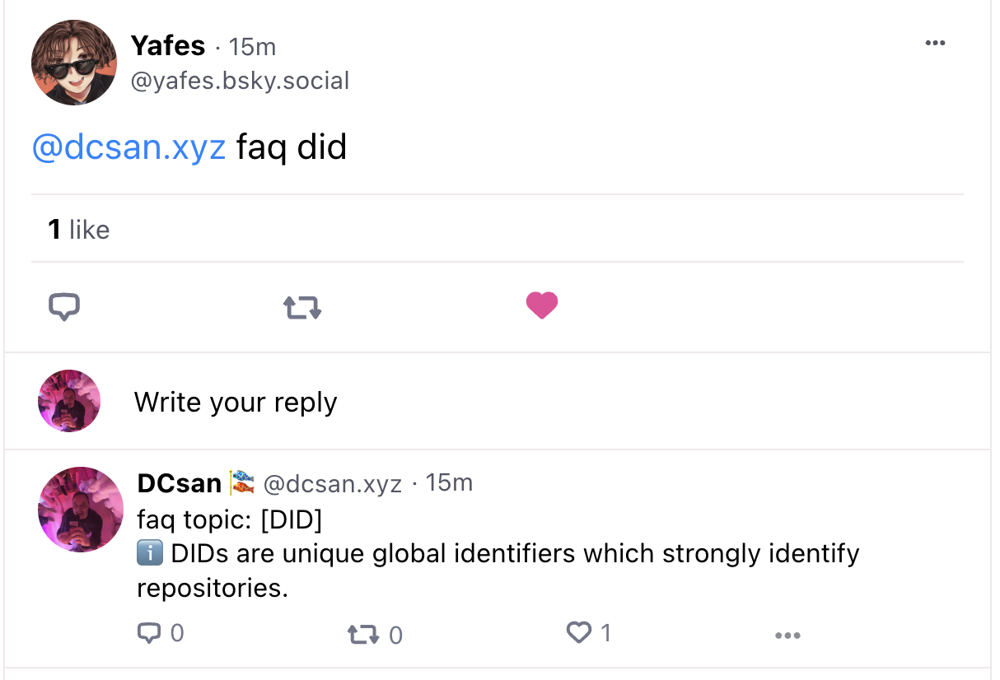

# bsky-faq-bot
bluesky faq bot

This is a simple FAQ bot to reply to common questions.


## account
Currently the bot just runs on my personal account until I can get another invite code to run it with. Use the 'faq' term in a skeet like this:

`@dcsan.xyz faq <topic>`

like this example:
- [psky link using DID](https://psky.app/profile/did:plc:h6gqfdny4khtwswuimwob75v/post/3juoniphefd2x)
- [web/staging](https://staging.bsky.app/profile/did:plc:h6gqfdny4khtwswuimwob75v/post/3juoniphefd2x)



Currently we just search for the keyword matches in [src/store/faqData.ts](./src/store/faqData.ts)

In future we can add more fuzzy matching and NLP classifiers, as well as adding new topics by users.

## Data
The content for the FAQs is currently stored in this google sheet.

[FAQ Database sheet](https://docs.google.com/spreadsheets/d/1RZ7ZDRXiZhu4fI65955gIAAuHNTf9__7ntHb2R65w3Q/edit#gid=0)


## Setup

`cp .env.example .env` and fill out the values.

You can get an app password from inside the bluesky app to not expose your main login creds.

```
BOT_HANDLE=example.bot.handle.com
BOT_PASSWORD=12345
```

## install

Using this awesome bot SDK from @tautologer

https://github.com/tautologer/easy-bsky-bot-sdk

For development I use a local linked version:

to do that you should check it out from it's own repo one level up from this bot's code. You'll find in the package.json a [local path](https://docs.npmjs.com/cli/v7/configuring-npm/package-json#local-paths) to the SDK:

`"easy-bsky-bot-sdk": "file:../easy-bsky-bot-sdk"`

For production, depending on how you deploy, you probably want to replace it with a published version:

npm install --save easy-bsky-bot-sdk


## just file
There's a justfile with some other useful commands. Install [just](https://github.com/casey/just) to use these.

## TODO
- [ ] custom openAI finetune
- [ ] pipeline from openAI/GPT responses to local FAQ to enable images and other custom metadata
- [ ] fuzzy matching on questions
- [ ] search for best keyword hits in a question
- [ ] NLP classifier matching
- [ ] /teach command to add new questions and answers

